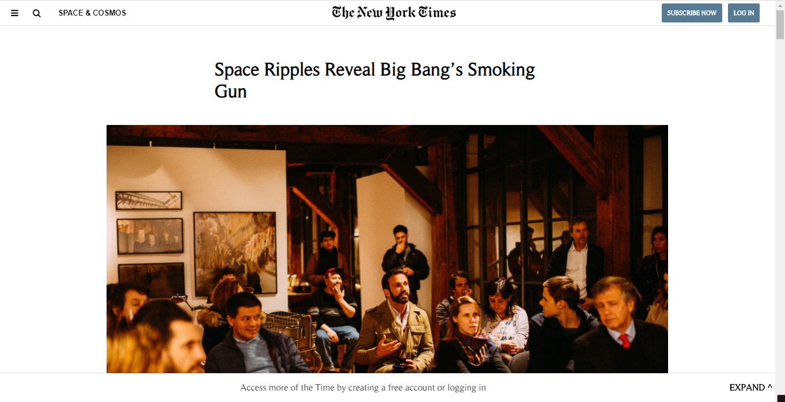

# Positioning and Floating Elements

> This is the first project for the week 1.

This is a clone of a New York Times article made from scratch using sematic HTML and CSS3.

## Built With

- HTML5
- CSS
- Git

## Live Demo

[Live Demo Link](https://notengobattery.github.io/project-1)

## Getting Started

To get a local copy up and running follow these simple example steps.

### Usage
You can open the `index.html` in your web browser.

## Authors

👤 **Oever González**

- GitHub: [@notengobattery](https://github.com/notengobattery)
- Twitter: [@notengobattery](https://twitter.com/notengobattery)
- LinkedIn: [LinkedIn](https://linkedin.com/josé-oever-gonzález-hernández-7b822a1b6)

👤 **Abdul Khaliq**

- GitHub: [@AK-Devil](https://github.com/AK-Devil)
- Twitter: [@AbdulKh99672072](https://twitter.com/AbdulKh99672072)
- LinkedIn: [LinkedIn](https://linkedin.com/abdul-khaliq-89452b1a9)

## 🤝 Contributing

Contributions, issues, and feature requests are welcome!

Feel free to check the [issues page](issues/).

## Show your support

Give a ⭐️ if you like this project!

## Acknowledgments

- Hat tip to anyone whose code was used
- Inspiration
- etc

## 📝 License

This project is [MIT](lic.url) licensed.
